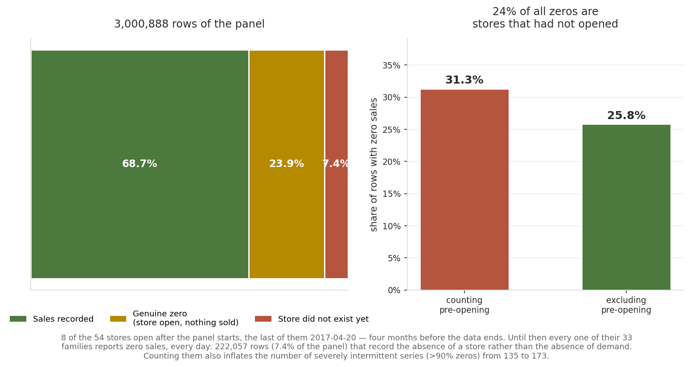
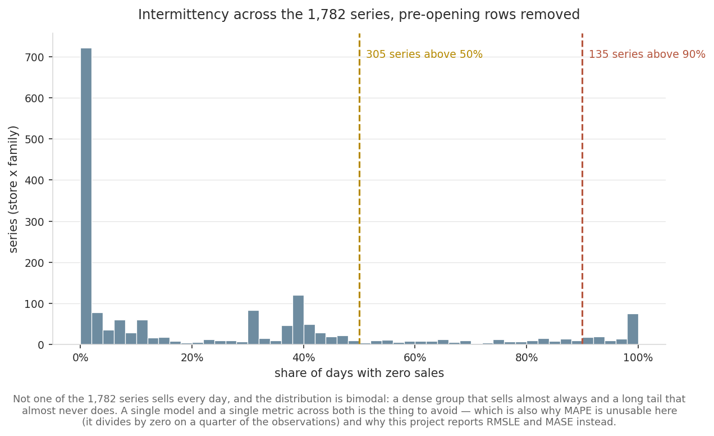
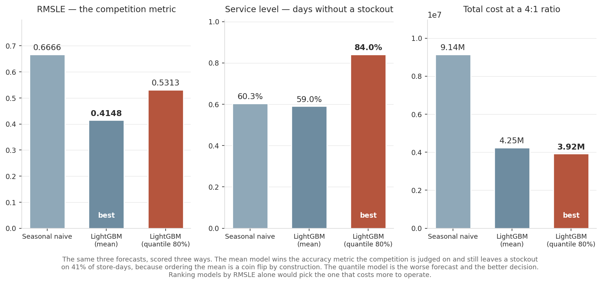
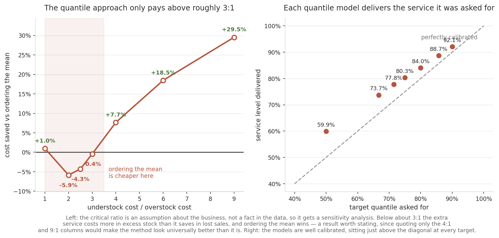

[ 🇺🇸 [Read in English](README.md) ] | [ 🇨🇱 Español ]

# Forecasting de demanda retail, evaluado como decisión de inventario


[](https://github.com/Rxyxs/retail-demand-forecasting-favorita/actions/workflows/tests.yml)


Un pipeline de pronóstico de demanda sobre **3.000.888 filas de ventas reales de
supermercado**, construido alrededor de una pregunta que la métrica de la competencia no
responde: *¿este pronóstico lleva a una mejor orden de compra?*

La respuesta corta, medida acá, es que las dos preguntas eligen modelos distintos. El
modelo con mejor RMSLE deja quiebre de stock en el **41% de los días-local**. El modelo
que gana la decisión de compra es **el peor pronóstico según todas las métricas de
exactitud salvo una**.

---

## El dataset

| | |
|---|---|
| Fuente | [Store Sales — Time Series Forecasting](https://www.kaggle.com/competitions/store-sales-time-series-forecasting) (Corporación Favorita, Ecuador) |
| Descargado | 2026-10-02, vía la API de Kaggle |
| Licencia | Rigen las reglas de la competencia; los datos crudos **no se redistribuyen** en este repositorio |
| Tamaño | 3.000.888 filas · 54 locales × 33 familias de producto · 2013-01-01 a 2017-08-15 |
| Covariables | precio diario del petróleo, feriados nacionales/regionales, promociones, metadatos de local |

**Por qué datos de supermercado ecuatoriano en un portafolio enfocado en Chile, dicho sin
rodeos:** la demanda retail granular (SKU × local × día) no es pública, ni en Chile ni en
ninguna parte. El catálogo de datos abiertos chileno lista el índice de supermercados del
INE sin archivo adjunto, y el portal de series del Banco Central pide cuenta. La elección
era entre demanda real de una cadena sudamericana comparable o demanda inventada con
etiqueta chilena. Este repositorio toma los datos reales y dice de dónde vienen. El
pipeline no es específico de un país; las features de quincena y feriados se trasladan
directo.

```bash
kaggle competitions download -c store-sales-time-series-forecasting -p data/raw --unzip
```

---

## 1. Un cuarto de la "demanda cero" de este dataset no es demanda

El panel tiene 31,3% de ceros, lo que se lee como intermitencia severa y manda a buscar
Croston o un modelo inflado en cero. Ese número está mal, y la razón no está en el
esquema.



**Ocho de los 54 locales abren después de que empieza el panel** — el último el
2017-04-20, cuatro meses antes de que terminen los datos. El panel está completado, no
recortado: hasta que un local abre, sus 33 familias reportan cero ventas todos los días.
Son **222.057 filas, el 7,4% del panel, y el 23,6% de todos los ceros del dataset**, que
registran la ausencia de un local y no la ausencia de demanda.

De ahí se siguen tres cosas:

- La tasa real de ceros es **25,8%**, no 31,3%.
- El conteo de series severamente intermitentes (>90% ceros) baja de **173 a 135** — el
  22% de ellas era un artefacto.
- Un modelo entrenado sobre esas filas aprende "este local no vende" de un local que no
  había abierto, y una métrica calculada sobre ellas se acredita aciertos por predecir
  cero donde no había nada que predecir.

`src/data.py` marca esas filas en vez de borrarlas en silencio, para que cada paso
posterior decida si las usa y las dos versiones de cada número queden visibles.



Incluso después de la corrección, **ninguna de las 1.782 series vende todos los días**.
La distribución es bimodal: un grupo denso que vende casi siempre y una cola larga que
casi nunca. Es también la razón de que MAPE no aparezca en este repositorio: divide por
el valor real, que es cero en un cuarto de las observaciones.

---

## 2. El pronóstico que gana la métrica pierde la decisión

La competencia puntúa RMSLE sobre una predicción puntual. Pero nadie pide la media. Un
comprador pide una **cantidad**, y quedarse corto (venta perdida) no cuesta lo mismo que
pasarse (sobrestock, merma, capital inmovilizado). Eso es un problema de newsvendor, y su
respuesta no es la media sino un **cuantil fijado por la razón de costos**: `Cu / (Cu + Co)`.

El escenario de abajo supone que un quiebre cuesta **4x** un sobrestock — un supuesto
declarado, no un dato del dataset, que es por qué la §3 lo hace variar.



| Modelo | RMSLE ↓ | MASE ↓ | Pinball@80% ↓ | Nivel de servicio ↑ | Fill rate ↑ | Costo total ↓ |
|---|---:|---:|---:|---:|---:|---:|
| Naive estacional | 0,6666 | 1,762 | 64,11 | 60,3% | 87,8% | 9,14M |
| LightGBM (media) | **0,4148** | **0,811** | 29,78 | 59,0% | 94,3% | 4,25M |
| LightGBM (cuantil 80%) | 0,5313 | 1,177 | **27,50** | **84,0%** | **97,3%** | **3,92M** |

Mirá las dos primeras columnas y el modelo de media gana cómodo. Mirá las últimas tres y
lo vence un modelo cuyo RMSLE es 28% peor.

**El nivel de servicio del modelo de media es 59,0% — por debajo del 60,3% del naive
estacional**, a pesar de ser dramáticamente más exacto. No es una paradoja: pedir la
media condicional te deja corto aproximadamente la mitad de las veces por construcción,
por buena que sea la estimación de esa media. La exactitud mejoró; la decisión no.

El modelo cuantil llega ahí gastando sobrestock para comprar servicio: su costo de
quiebre cae de 3,06M a 1,45M mientras su costo de sobrestock sube de 1,19M a 2,47M. A una
razón de 4:1 ese canje conviene. A 1:1 no — que es el tema de la sección siguiente.

---

## 3. El resultado no se sostiene en toda razón de costos, y eso vale decirlo

La razón crítica es un supuesto sobre el negocio. Si la conclusión se da vuelta bajo una
alternativa plausible, citar solo la columna favorable es como un proyecto de portafolio
se vuelve engañoso.



| Razón de costos | Cuantil crítico | Costo cuantil | Costo media | Ahorro |
|---:|---:|---:|---:|---:|
| 1:1 | 50% | 1,93M | 1,95M | +1,0% |
| 2:1 | 67% | 2,88M | 2,72M | **−5,9%** |
| 2,5:1 | 71% | 3,23M | 3,10M | **−4,3%** |
| 3:1 | 75% | 3,50M | 3,48M | **−0,4%** |
| 4:1 | 80% | 3,92M | 4,25M | +7,7% |
| 6:1 | 86% | 4,71M | 5,77M | +18,5% |
| 9:1 | 90% | 5,68M | 8,07M | +29,5% |

**Por debajo de alrededor de 3:1, pedir la media sale más barato.** El servicio extra que
compra el cuantil cuesta más en stock sobrante de lo que ahorra en venta perdida, y el
método recién empieza a pagar sobre ese cruce. Citar solo las filas de 4:1 y 9:1 lo haría
parecer universalmente mejor de lo que es.

El panel derecho es la verificación de que los modelos hacen lo que se les pidió: el
nivel de servicio entregado sigue de cerca al cuantil solicitado en todos los niveles
(50%→59,9%, 67%→73,7%, 80%→84,0%, 90%→92,1%), ubicándose consistentemente apenas por
encima de la diagonal.

---

## Método

| Paso | Decisión | Por qué |
|---|---|---|
| Split | Últimos **16 días** separados por fecha | Es el horizonte que pide la competencia, así que el backtest mide el problema planteado. Nunca un split aleatorio: filtraría el futuro hacia el pasado. |
| Features | Rezagos 7/14/21/28, media y desvío móviles, tasa móvil de ceros, todos desplazados dentro de cada serie | Cada feature está disponible al momento de decidir. El desplazamiento se aplica dentro de `over(["store_nbr","family"])`, así que ninguna serie toma prestada la historia de otra. |
| Calendario | Día de semana, mes, día del año, **quincena** (15 y fin de mes) | En Ecuador, como en Chile, el sueldo se paga el 15 y el último día hábil, y la demanda de supermercado lo sigue. |
| Covariables | Precio del petróleo **rellenado hacia adelante**, feriados excluyendo los transferidos | El petróleo cotiza solo en días de mercado; el precio que importa para un domingo es el del viernes, no un promedio que mira al futuro. |
| Target | `log1p(ventas)` | Coincide con RMSLE y evita que tres órdenes de magnitud de tamaño de familia dominen el gradiente. |
| Línea base | Naive estacional (mismo día de la semana) | Un rival serio en retail. Un modelo que no le gana está aprendiendo el promedio, no la demanda. |

El terremoto de Ecuador de 2016 (16 de abril, magnitud 7,8) se marca en vez de
eliminarse: un modelo que no sabe que pasó lo aprende como estacionalidad de abril y lo
repite todos los años.

---

## Reproducir

```bash
python -m venv .venv
.venv/Scripts/activate              # Linux/macOS: source .venv/bin/activate
pip install -r requirements.txt

kaggle competitions download -c store-sales-time-series-forecasting -p data/raw --unzip

python -m pytest -q                 # 19 tests
python -m src.pipeline              # corrida completa -> outputs/results.json
python -m src.make_figures          # redibuja las cuatro figuras de arriba
```

Cada número de este README sale de `outputs/results.json`, que escribe el pipeline y que
está versionado para que las figuras se puedan verificar sin volver a correr nada.

---

## Tests

19 tests, todos sobre aritmética exacta o identidades de libro en vez de sobre la descarga
de 3M de filas, así que corren en CI en menos de un segundo.

| Propiedad | Por qué importa |
|---|---|
| La fecha de apertura es la primera **venta positiva**, no la primera fila | Tomar la primera fila devuelve 2013-01-01 para todos los locales y borra todo el hallazgo de la §1 |
| Las filas pre-apertura se marcan y son todas cero | La bandera es lo que separa "sin demanda" de "sin local" |
| La intermitencia cambia al contar pre-apertura | Codifica la corrección 173 → 135 como test sobre un panel de juguete |
| El precio del petróleo se rellena hacia adelante, nunca se interpola | Un precio interpolado es una filtración del futuro que jamás aparecería como falla |
| La pérdida pinball es asimétrica en la dirección que dice el cuantil | Un error de signo acá invertiría en silencio la conclusión del proyecto |
| La razón crítica es `Cu/(Cu+Co)` | La única línea que conecta un supuesto de costos con una elección de modelo |
| Pedir la media deja ~50% de servicio con demanda simétrica | La afirmación central del proyecto, como aserción |
| Pedir el cuantil crítico alcanza su servicio objetivo | Confirma el mecanismo, no solo el resultado |

---

## Limitaciones honestas

- **Newsvendor de un período.** No hay inventario que se arrastre entre días, así que el
  sobrante de hoy no amortigua el faltante de mañana. Las dos columnas de costo bajarían
  bajo un modelo con arrastre; lo que sobrevive es la asimetría entre los dos errores, que
  es el punto que se está haciendo.
- **La razón de costos es supuesta, no medida.** Favorita no publica margen ni costo de
  mantención. La §3 es la mitigación, y muestra que la conclusión depende de la razón.
- **Sin reconciliación jerárquica.** Los pronósticos local × familia no están obligados a
  sumar los totales por local o nacionales. Para un comprador que trabaja a nivel de
  familia eso no restringe, pero un planificador que reporta hacia arriba lo necesitaría.
- **Ecuador, no Chile.** Declarado arriba y repetido acá. La estacionalidad que se
  traslada (ciclos de quincena, Navidad, calendario escolar) está explícita en las
  features; los niveles de demanda no se trasladan y no se afirma que lo hagan.
- **Horizonte de 16 días, un solo split.** Un backtest de origen móvil sobre varias
  ventanas pondría una barra de error a estas comparaciones. Este no lo hace, así que las
  diferencias de las tablas de arriba no llevan intervalo de confianza.

---

## Licencia

MIT — ver [LICENSE](LICENSE). El dataset de Favorita se rige por las reglas de la
competencia y no se redistribuye acá.
